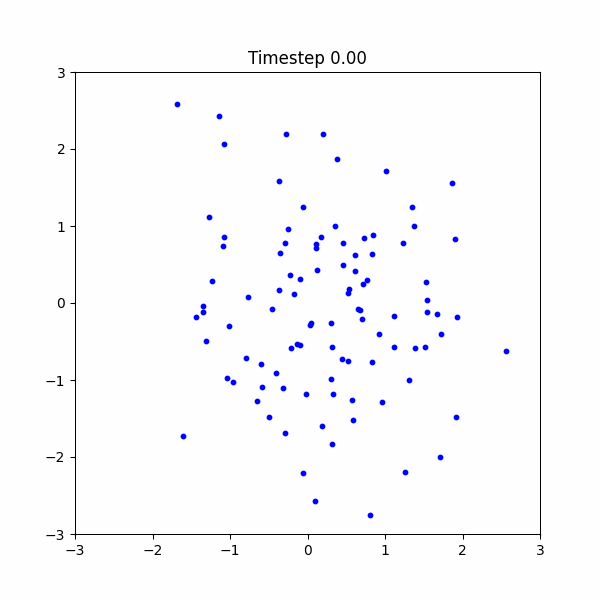

## FLow matching guide- GUIDE

1. Noisy data
2. Final Output data

Both are of same dimensions

## Timesteps
During training, the timestep selected is random
whereas 
during inference, timestep is gradual.

## random value
A random value in [0, 1) is sampled each training step.
The model learns the vector field across all timesteps.

## References for even better understanding:

1. https://diffusion.csail.mit.edu/docs/lecture-notes.pdf
2. https://neurips.cc/virtual/2024/tutorial/99531
3. https://medium.com/@uisdahl/understanding-flow-matching-de2f706cb09d
4. https://www.youtube.com/watch?v=7cMzfkWFWhI&t=409s

